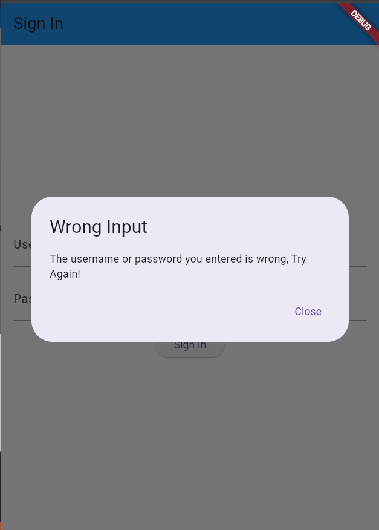
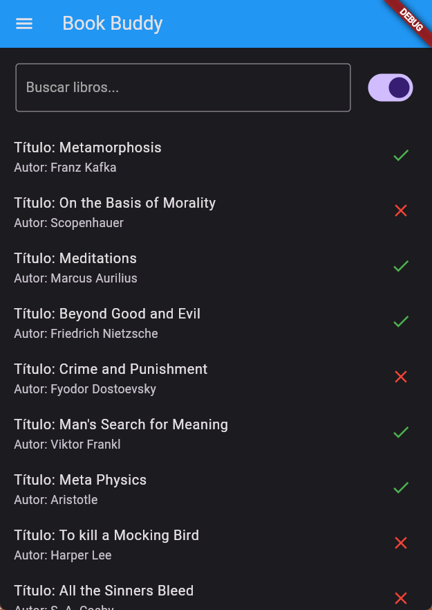
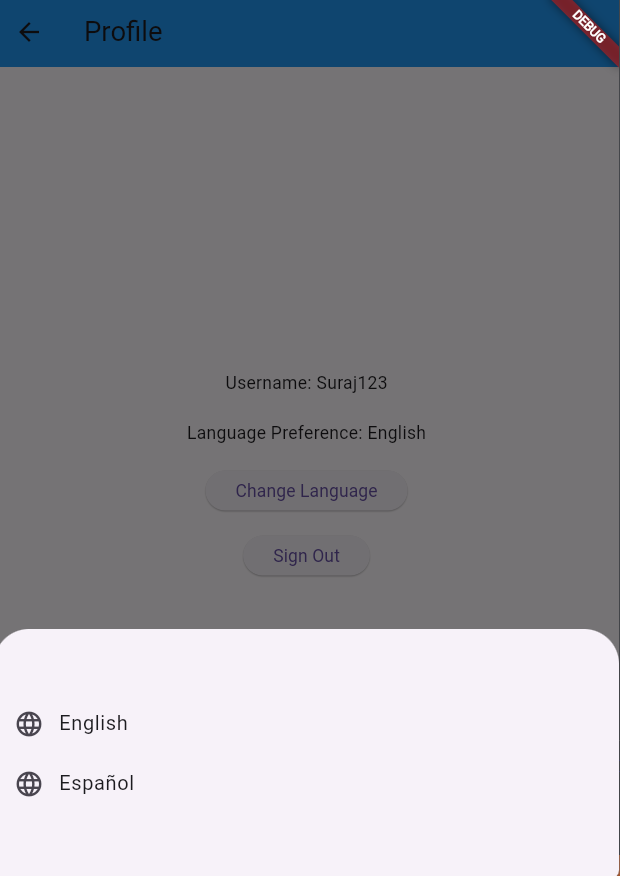

# Book Buddy

A Flutter project to view books in a library.

## Description

This repository contains code for Book Buddy, a flutter application I built as an assignment. Use this info to login
- Username: **Suraj123**
- Password: **pass123**

### Key Points:
- In **Memory** Login (no DB).
- **Search Bar** (Searches on book **title** and **author**).
- **Book Availibilty** (represented by a **green tick** and **red cross**).
- **Theme Toggle** (toggle between **dark/light** theme on homepage).
- **Multilanguage Support** (**English** and **Spanish(espanol)** for now).

## References

These are the major sites that I referenced for the development:
- https://docs.flutter.dev/get-started/codelab
- https://flutter.dev/learn
- https://docs.flutter.dev/ui/widgets
- https://pub.dev
- https://docs.flutter.dev/ui/accessibility-and-internationalization/internationalization
- https://github.com/flutter/website/blob/main/examples/internationalization/gen_l10n_example/lib/l10n/app_en.arb
- https://ripenapps.com/blog/building-multilingual-apps-in-flutter/

Also used:
- ChatGpt
- StackOverflow

## Images

## Learnings
